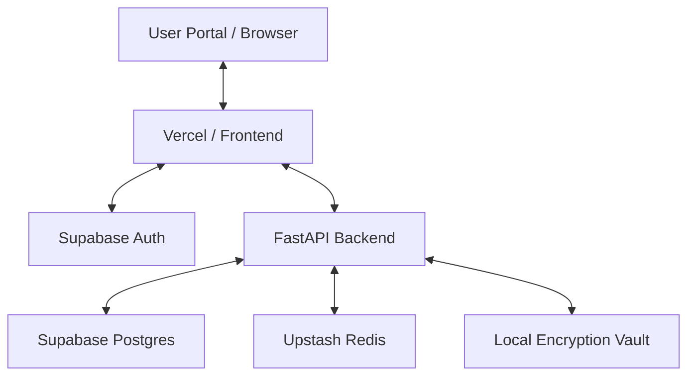

# Kryonex Studio: AI-Agentic Ecosystem 🌌

**Kryonex** is a high-fidelity, professional-grade portfolio and administrative hub designed for the modern AI and Agentic era. It combines a stunning "Mission Control" user interface with a robust, secure backend for managing personal keys, categorical projects, and platform-wide visibility.

---

## 🚀 Key Features

### 🏛️ Mission Control (User Portal)
- **TechStack Visualizer**: An interactive, dynamic topology of the core technology stack powered by Framer Motion.
- **Project Archives**: A centralized hub for GenAI, Agentic AI, and Machine Learning projects.
- **Real-time Sync**: Live updates via Supabase for project publishing and status changes.
- **PWA Ready**: Offline support and home-screen installation capabilities.

### 🔐 Admin Vault (Secure Management)
- **Credential Storage**: Securely store API keys (Groq, OpenAI, Google) with encryption-masking.
- **Single-Line Management**: Optimized, grid-aligned interface for high-efficiency key management.
- **Masked Privacy**: Quick-toggle visibility and one-click copy functionality.
- **Backend Lockdown**: JWT-based server-side verification ensuring only the administrator can access sensitive endpoints.

### ⚙️ Platform Control
- **Dynamic Categories**: Add, remove, and manage project domains on the fly.
- **One-Tap Imports**: Import project metadata, tech stacks, and READMEs directly from GitHub repositories.
- **Visibility Toggles**: Global "Site Settings" to control feature availability and publishing permissions.

---

## 🛠️ The Stack

| Component | Technology |
| :--- | :--- |
| **Frontend** | React, Tailwind CSS, Lucide Icons, Framer Motion |
| **Backend** | FastAPI (Python 3.10+), Gunicorn |
| **Database** | Supabase (Postgres) |
| **Caching** | Upstash Redis, LRU memory-cache |
| **Security** | Supabase Auth (OIDC), JWT Token Bearer |
| **Push** | PyWebPush, Service Worker (Vite PWA) |

---

## 🏗️ Architecture



---

## 📦 Getting Started

### Prerequisites
- Node.js 18+
- Python 3.9+
- Supabase Account
- Upstash Account

### Installation

1. **Clone & Install Dependencies**
   ```bash
   # Install Frontend
   cd client && npm install

   # Install Backend
   cd ../server && pip install -r requirements.txt
   ```

2. **Environment Configuration**
   Create a `.env` in both `client/` and `server/` with the following:
   - `SUPABASE_URL`
   - `SUPABASE_KEY`
   - `VITE_ADMIN_EMAIL`
   - `VITE_API_URL`

3. **Running Locally**
   ```bash
   python start.py
   ```

---

## 🛡️ Security Policy

Kryonex implements a **Zero-Trust Administrative Policy**:
- **UI Guard**: `AuthGuard` restricts navigation based on administrator email.
- **Server Guard**: All data-mutating routes (`POST`, `PUT`, `DELETE`) and the Vault require a valid Supabase Session Token.
- **File Protection**: Sensitive persistence files (`vault.json`, `settings.json`) are automatically excluded from version control via hardened `.gitignore`.

---

## 📜 License

© 2026 Kryonex by Ayush Jain. All rights reserved. Built for the future of AI automation.
